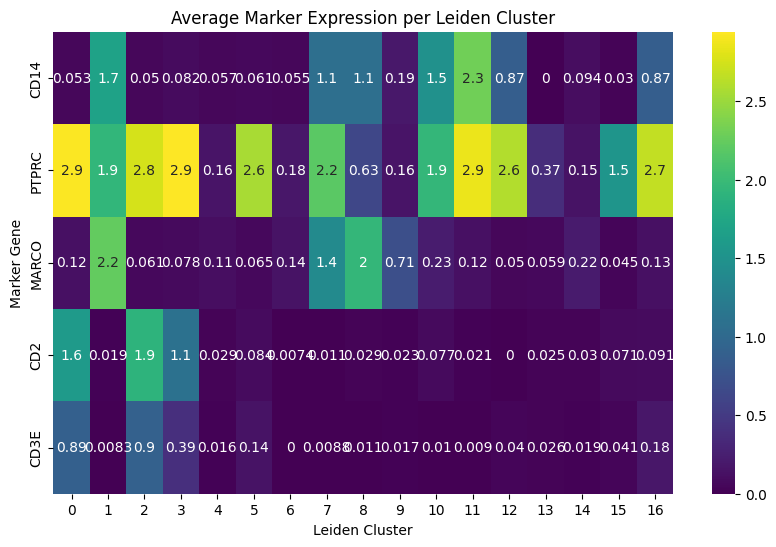
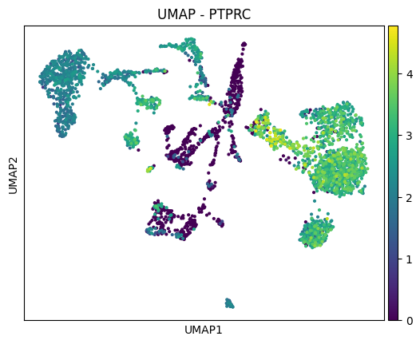
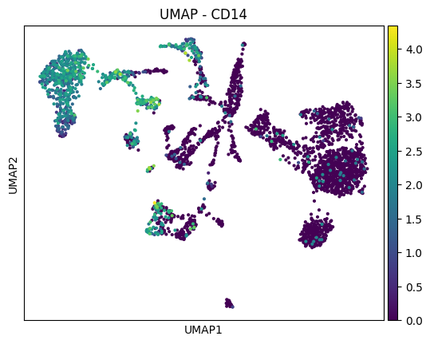
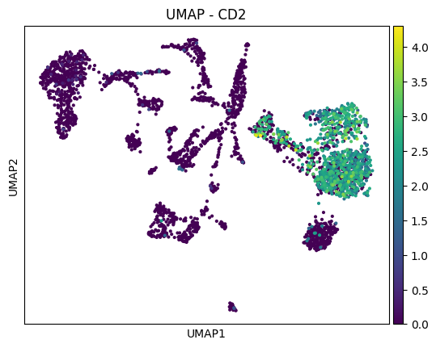
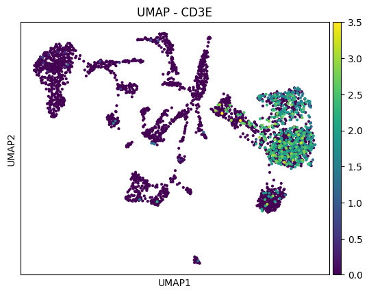
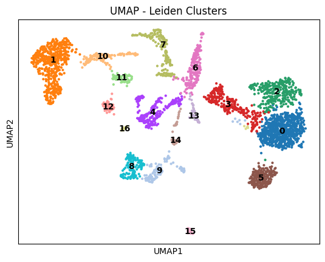

# 🧬 Single-Cell RNA-Seq Analysis of SARS-CoV-2 Infected Monkey Lungs

This project explores and analyzes single-cell RNA sequencing (scRNA-Seq) data from **Speranza et al.**, who studied SARS-CoV-2 infection in monkey lungs as a model of human infection.

📄 [Publication](https://www.ncbi.nlm.nih.gov/pmc/articles/PMC7875333/)  
🧪 [GEO Dataset (GSE156755)](https://www.ncbi.nlm.nih.gov/geo/query/acc.cgi?acc=GSE156755)  
📦 Raw file used: `GSE156755_RAW.tar`, focusing on sample `GSM4743527_16434`

---

## 📌 Objectives

This notebook performs the following tasks:

1. Download and extract scRNA-Seq data from GEO.
2. Load and preprocess the data using **Scanpy**.
3. Report basic QC metrics: number of cells and genes.
4. Identify the top 5 most expressed genes.
5. Perform dimensionality reduction using **PCA**.
6. Cluster cells with optimized **neighbors** and **PCA dimensions** based on silhouette score.
7. Compute a **UMAP** embedding.
8. Visualize key **marker genes** on UMAP:
   - `PTPRC`, `MARCO`, `CD14`, `CD2`, `CD3E`, `CD56`
9. Identify potential **cell types** based on gene expression patterns.
10. Detect SARS-CoV-2 infected cells based on viral gene expression.

---

## 🛠️ Requirements

Make sure to install the following Python libraries:

```bash
pip install scanpy matplotlib seaborn scikit-learn

</br>
---

## 📊 Marker Gene Expression by Cluster


## 🌐 UMAP Plots of Key Marker Genes

### PTPRC


### MARCO


### CD14


### CD2


### CD3E


### Leiden Clustering

